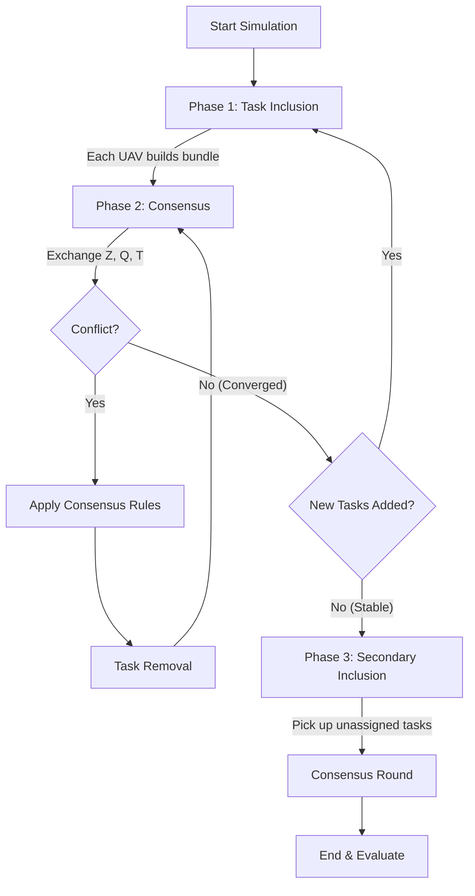

# DATW Algorithm — Code Documentation

## 1. Overview

**DATW** (**D**istributed **A**llocation with **T**ime **W**indows) is a decentralized algorithm for assigning tasks to multiple UAVs (Unmanned Aerial Vehicles). Unlike centralized systems where one "master" computer decides everything, in DATW, each UAV makes its own decisions locally and then talks to its neighbors to resolve conflicts.

Key features:
*   **Decentralized**: No single point of failure.
*   **Time Windows**: Tasks must start within a specific time range `[Start, End]`.
*   **Consensus**: UAVs agree on who does what by comparing "bids" (significance scores).

The implementation is split across these files:

| File | Role |
|---|---|
| [shared/utils.py](file:///c:/Users/91630/Desktop/drones/multi-uav-distributed-consensus/shared/utils.py) | Basic math helpers (distance calculation). |
| [shared/models.py](file:///c:/Users/91630/Desktop/drones/multi-uav-distributed-consensus/shared/models.py) | Defines [Task](file:///c:/Users/91630/Desktop/drones/multi-uav-distributed-consensus/shared/models.py#6-26) and the base [UAV](file:///c:/Users/91630/Desktop/drones/multi-uav-distributed-consensus/shared/models.py#28-298) class. |
| [algs/datw/uav.py](file:///c:/Users/91630/Desktop/drones/multi-uav-distributed-consensus/algs/datw/uav.py) | The core DATW logic ([DATWUAV](file:///c:/Users/91630/Desktop/drones/multi-uav-distributed-consensus/algs/datw/uav.py#4-127)), implementing the specific scoring formulas. |
| [algs/runners.py](file:///c:/Users/91630/Desktop/drones/multi-uav-distributed-consensus/algs/runners.py) | The simulation loop ([ConsensusRunner](file:///c:/Users/91630/Desktop/drones/multi-uav-distributed-consensus/algs/runners.py#5-127)) that runs the phases. |
| [shared/simulation_utils.py](file:///c:/Users/91630/Desktop/drones/multi-uav-distributed-consensus/shared/simulation_utils.py) | Setup and metrics calculation. |

---

## 2. Data Structures

### 2.1 [Task](file:///c:/Users/91630/Desktop/drones/multi-uav-distributed-consensus/shared/models.py#6-26) ([shared/models.py](file:///c:/Users/91630/Desktop/drones/multi-uav-distributed-consensus/shared/models.py))

A task represents a location a UAV must visit.

*   `id`: Unique number for the task.
*   `location`: [(x, y, z)](file:///c:/Users/91630/Desktop/drones/multi-uav-distributed-consensus/algs/runners.py#17-127) coordinates.
*   `duration`: How long the UAV stays at the task.
*   `time_window`: `[Early_Start, Late_Start]`. The task cannot start before `Early_Start`.

### 2.2 [UAV](file:///c:/Users/91630/Desktop/drones/multi-uav-distributed-consensus/shared/models.py#28-298) State Vectors ([shared/models.py](file:///c:/Users/91630/Desktop/drones/multi-uav-distributed-consensus/shared/models.py))

Each UAV maintains four key lists (vectors) that represent its view of the world. These are updated locally and shared with others.

| Vector | Name | Description |
|---|---|---|
| **Z** | Assignment Map | Who owns task `j`?   `Z[j] = i` means UAV `i` owns it.   `Z[j] = -1` means it's unassigned. |
| **Q** | Significance Map | What is the "bid" or score for task `j`?   Lower `Q` values are better (usually).   `Q[j]` stores the best score seen so far for task `j`. |
| **T** | Time Map | When does task `j` start?   `T[j]` is the scheduled start time. |
| **s** | Timestamp Map | When did I last hear from UAV `k`? Used to ignore old information. |

---

## 3. The Core Concept: Significance (Scoring)

The heart of DATW is how a UAV decides if a task is "good" for it. This is calculated in [algs/datw/uav.py](file:///c:/Users/91630/Desktop/drones/multi-uav-distributed-consensus/algs/datw/uav.py).

### 3.1 Cost Function: `F(path)`

The "cost" of a path (a sequence of tasks) is simply the **sum of completion times**.

`Cost = Sum(Start_Time_k + Duration_k) for all tasks in path`

We want to **minimize** this cost.

### 3.2 Significance: `q_ij` (Formula 12)

**"How important is this task to my current path?"**

When a UAV `i` already has a path `Pi`, the significance of a specific task `j` in that path is:

`Significance = (Cost_with_j - Cost_without_j) * (Start_Time_j - Window_Start_j)`

*   **Term 1 (`Cost_with_j - Cost_without_j`)**: The marginal cost. How much does adding this task increase my total mission time?
*   **Term 2 (`Start_Time_j - Window_Start_j`)**: The slack. How close to the opening time strictly can I do it? 
    *   Small slack = Urgent! I am doing it as early as possible.
    *   Large slack = I am doing it late, so maybe someone else can do it better.

**Intuition**: We want small values. A small value means "I can do this task efficiently (low cost increase) AND I can do it early (low slack)."

### 3.3 Marginal Significance: `q*_ij` (Formula 13)

**"What is the best possible score if I add this NEW task?"**

When considering a **new** task `j` that is NOT in the path yet, the UAV tries inserting it at every possible position `k` in its current path.

`Marginal_Sig = Min over all positions k of: [ (New_Cost - Old_Cost) * (Start_Time_j - Window_Start_j) ]`

This function finds the **best insertion point** for the task. If the task cannot be inserted anywhere without violating time windows, it returns `infinity`.

---

## 4. The Algorithm Phases ([algs/runners.py](file:///c:/Users/91630/Desktop/drones/multi-uav-distributed-consensus/algs/runners.py))

The algorithm runs in a loop until everyone agrees (Consensus).

### Phase 1: Task Inclusion (Bundle Building)

**Goal**: Each UAV greedily adds tasks to its local bundle to improve the global score.

1.  **Identify Candidates**: the UAV looks at every task `j` in the world.
2.  **Calculate Improvement**:
    *   Calculate `q*` (best cost to add `j` to my path).
    *   Compare `q*` with `Q[j]` (the current network-best score for this task).
    *   If `q* < Q[j]`, it means "I can do this task better than whoever currently owns it!"
3.  **Select Best Move**:
    *   The UAV picks the one task that gives the **biggest improvement** (`Q[j] - q*`).
4.  **Update**:
    *   Insert the task into the path.
    *   `Z[j] = my_id` (I claim it).
    *   `Q[j] = q*` (Update the score).
    *   `T[j] = start_time` (Update the time).

This repeats until the UAV is full or can't find any more tasks to improve.

### Phase 2: Conflict Resolution (Consensus)

**Goal**: UAVs talk to each other to resolve conflicting claims.

1.  **Communication**: Every UAV sends its `Z`, `Q`, `T` vectors to its neighbors.
2.  **Update Rule ([update_state](file:///c:/Users/91630/Desktop/drones/multi-uav-distributed-consensus/shared/models.py#203-245) in [shared/models.py](file:///c:/Users/91630/Desktop/drones/multi-uav-distributed-consensus/shared/models.py))**:
    When UAV `i` receives data from neighbor `k` regarding task `j`:
    
    *   **Case A: We both claim it.** (`Z[j]=i` and `Neighbor_Z[j]=k`)
        *   Compare scores (`Q[j]`).
        *   If `Neighbor_Q[j] < My_Q[j]`: **They win.** They have a better (lower) score. I update my `Z[j]=k` and `Q[j]=Neighbor_Q[j]`.
        *   If scores are equal: Tie-break using UAV IDs (smaller ID wins).
        
    *   **Case B: They claim it, I don't.** (`Z[j] != i` and `Neighbor_Z[j]=k`)
        *   If their score is better than what I previously knew (`Neighbor_Q[j] < My_Q[j]`), I accept their claim. Update `Z` and `Q`.
        
    *   **Case C: They say it's unassigned.** (`Neighbor_Z[j] = -1`)
        *   If I thought `k` owned it (`Z[j]=k`), but `k` says "I dropped it", then I update `Z[j] = -1`.

3.  **Task Removal ([task_removal](file:///c:/Users/91630/Desktop/drones/multi-uav-distributed-consensus/shared/models.py#246-291))**:
    After updating, I might find that I lost a task I asserted in Phase 1 (e.g., someone else had a better score).
    *   **Remove Lost Tasks**: If `Z[j]` is no longer `my_id`, I remove task `j` from my path.
    *   **Check Feasibility**: Removing a task might shift times for subsequent tasks. If this causes a time window violation strictness later in the path, drop those violating tasks too.

### Phase 3: Secondary Inclusion (Reallocation)

**Goal**: Pick up any "leftover" tasks that no one claimed.

This runs **after** Phase 1 & 2 have fully converged (everyone agrees).

1.  **Identify Unassigned**: Look for tasks where `Z[j] = -1`.
2.  **Bid with Caution**:
    *   Calculate `q*` for these tasks.
    *   Pick the task with the **lowest absolute `q*`** (minimal cost increase).
    *   **Crucial Difference**: In Phase 1, we maximize *improvement* vs current owner. In Phase 3, there is no owner, so we just minimize *our own cost increase*.
3.  **Add & Repeat**: Add the best task, update vectors, and repeat until full.

---

## 5. File Walkthrough

### [shared/utils.py](file:///c:/Users/91630/Desktop/drones/multi-uav-distributed-consensus/shared/utils.py)
Simple math.
*   [calculate_distance(a, b)](file:///c:/Users/91630/Desktop/drones/multi-uav-distributed-consensus/shared/utils.py#3-9): Returns distance between two 3D points.

### [shared/models.py](file:///c:/Users/91630/Desktop/drones/multi-uav-distributed-consensus/shared/models.py)
The foundation.
*   [Task](file:///c:/Users/91630/Desktop/drones/multi-uav-distributed-consensus/shared/models.py#6-26): The data object.
*   [UAV](file:///c:/Users/91630/Desktop/drones/multi-uav-distributed-consensus/shared/models.py#28-298): The parent class. It handles:
    *   [task_inclusion()](file:///c:/Users/91630/Desktop/drones/multi-uav-distributed-consensus/shared/models.py#117-186): The logic for the "greedy add" loop.
    *   [update_state()](file:///c:/Users/91630/Desktop/drones/multi-uav-distributed-consensus/shared/models.py#203-245): The consensus logic (comparing Z/Q/T vectors).
    *   [task_removal()](file:///c:/Users/91630/Desktop/drones/multi-uav-distributed-consensus/shared/models.py#246-291): Logic to drop tasks if we lose the bid.
    *   [_calculate_times_for_sequence()](file:///c:/Users/91630/Desktop/drones/multi-uav-distributed-consensus/shared/models.py#70-88): Iterates through a list of tasks to find start/end times.

### [algs/datw/uav.py](file:///c:/Users/91630/Desktop/drones/multi-uav-distributed-consensus/algs/datw/uav.py) ([DATWUAV](file:///c:/Users/91630/Desktop/drones/multi-uav-distributed-consensus/algs/datw/uav.py#4-127))
The "Brain" of DATW.
*   Inherits from [UAV](file:///c:/Users/91630/Desktop/drones/multi-uav-distributed-consensus/shared/models.py#28-298).
*   **Overrides** [calculate_significance](file:///c:/Users/91630/Desktop/drones/multi-uav-distributed-consensus/shared/models.py#101-107): Implements Formula 12.
*   **Overrides** [calculate_marginal_significance](file:///c:/Users/91630/Desktop/drones/multi-uav-distributed-consensus/shared/models.py#108-115): Implements Formula 13 (try all positions).
*   **Adds** [secondary_inclusion](file:///c:/Users/91630/Desktop/drones/multi-uav-distributed-consensus/shared/models.py#292-298): The special Phase 3 logic.

### [algs/runners.py](file:///c:/Users/91630/Desktop/drones/multi-uav-distributed-consensus/algs/runners.py) ([ConsensusRunner](file:///c:/Users/91630/Desktop/drones/multi-uav-distributed-consensus/algs/runners.py#5-127))
The "Simulator".
*   [run()](file:///c:/Users/91630/Desktop/drones/multi-uav-distributed-consensus/algs/runners.py#17-127) method:
    *   Loop `max_iterations`:
        *   Run [task_inclusion](file:///c:/Users/91630/Desktop/drones/multi-uav-distributed-consensus/shared/models.py#117-186) for all UAVs.
        *   Run [communicate](file:///c:/Users/91630/Desktop/drones/multi-uav-distributed-consensus/shared/models.py#193-202) and [update_state](file:///c:/Users/91630/Desktop/drones/multi-uav-distributed-consensus/shared/models.py#203-245) loop until consensus.
        *   Check for global convergence (no changes).
    *   If converged, run [secondary_inclusion](file:///c:/Users/91630/Desktop/drones/multi-uav-distributed-consensus/shared/models.py#292-298) (Phase 3).
    *   Calculate final metrics.

### [shared/simulation_utils.py](file:///c:/Users/91630/Desktop/drones/multi-uav-distributed-consensus/shared/simulation_utils.py)
*   [setup_scenario](file:///c:/Users/91630/Desktop/drones/multi-uav-distributed-consensus/shared/simulation_utils.py#5-42): Creates random tasks and UAVs.
*   [evaluate_metrics](file:///c:/Users/91630/Desktop/drones/multi-uav-distributed-consensus/shared/simulation_utils.py#43-97): Checks if the final solution is valid (no time overlaps, all constraints met) and sums up the total cost.

---

## 6. Diagram

